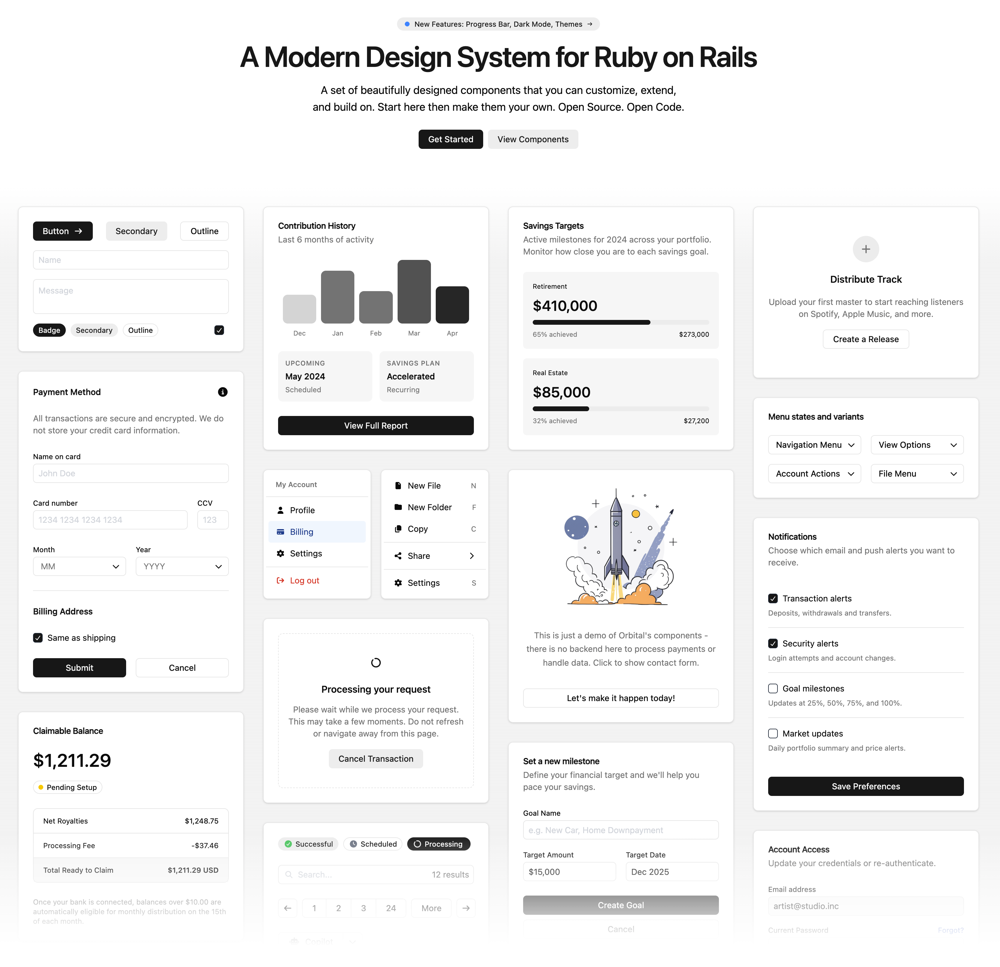

# Orbital



A modern design system and component library for Ruby on Rails, built with the [ORB Template Language](https://github.com/kuyio/orb_template) and [Tailwind CSS v4](https://tailwindcss.com/). Ship polished interfaces without leaving Rails.

## Project Structure

- **`orbital/`** — The Orbital gem: components, styles, and JavaScript
- **`demo/`** — A Rails app that documents and showcases every component

## Getting Started

### Prerequisites

- Ruby 3.x
- [Bun](https://bun.sh/) (or Node.js)
- Bundler

### Installation

```bash
cd demo
bundle install
bun install
```

### Running the Demo

```bash
cd demo
foreman start -f Procfile.dev
```

Open [http://localhost:3000](http://localhost:3000) to browse the component library.

## Components

### Layout & Structure
- **Accordion** — Collapsible content sections with keyboard navigation
- **Card** — Content containers with optional header and footer slots
- **Expander** — Flexible spacer for distributing space in flex layouts
- **Separator** — Horizontal or vertical dividers between content sections

### Navigation
- **Navigation Menu** — Responsive site navigation with mobile drawer
- **Dropdown** — Trigger/content pattern for menus and popovers
- **Menu** — Structured menu with items, labels, separators, and submenus

### Data Display
- **Avatar** — User avatars with initials or Gravatar integration
- **Badge** — Small status indicators and labels
- **Icon** — FontAwesome icon integration with size variants
- **Image** — Asset pipeline image component
- **Kbd** — Keyboard shortcut display
- **Progress Bar** — Horizontal bar with value/max fill calculation
- **Spinner** — Loading indicators
- **Tooltip** — Contextual information on hover

### Typography
- **Heading** — Semantic headings with size scale (xs–4xl)
- **Text** — Body text with size, weight, tone, and alignment control
- **Prose** — Long-form content styling
- **Typography** — Display type for marketing pages

### Forms
- **Button** — Primary, secondary, outline, ghost, and destructive variants
- **Button Group** — Visually connected button sets
- **Check Box** — Toggle inputs with labels and help text
- **Select** — Custom dropdown select with search
- **Text Field** — Inputs and textareas with icons, prefix/suffix, and validation

### Feedback
- **Alert** — Contextual messages with tone variants
- **Dialog** — Modal dialogs with header, body, and footer
- **Confirmation Dialog** — Confirm/cancel pattern
- **Delete Dialog** — Destructive action confirmation

### Overlay
- **Modal** — Full-screen overlay container
- **Popcard** — Hover card previews
- **Popover** — Anchored floating content

## Customization

Orbital uses a semantic color system powered by CSS custom properties. Override any variable after importing the theme:

```css
@import "orbital/theme";

:root {
  --primary: hotpink;
  --primary-foreground: white;
  --radius: 0.25rem;
}
```

### Theme Variables

Colors, surfaces, and radii are defined in `orbital/app/assets/stylesheets/orbital/theme.css`. The full set includes:

- **Surfaces** — `--background`, `--card`, `--popover`, `--muted`, `--accent`
- **Interactive** — `--primary`, `--secondary`, `--destructive`
- **Semantic tones** — `--tone-success`, `--tone-warning`, `--tone-danger`, `--tone-info`, `--tone-magic`
- **Borders & inputs** — `--border`, `--input`, `--ring`
- **Typography** — `--font-weight-normal`, `--font-weight-medium`, `--font-weight-semibold`, `--font-weight-bold`
- **Shape** — `--radius`

### Dark Mode

Add the `.dark` class to your root element. All theme variables swap automatically — no extra configuration needed. The demo app includes a toggle in the navbar.

### Component Overrides

Every component accepts a `class` attribute for one-off adjustments via Tailwind utilities:

```orb
<Button variant="outline" class="w-full">Full Width</Button>
<Card class="border-primary">Highlighted Card</Card>
```

## Contributing

1. Fork the repository
2. Create a feature branch
3. Make your changes
4. Test with the demo application
5. Submit a pull request

## License

This project is open source and available under the [MIT License](LICENSE.txt).
